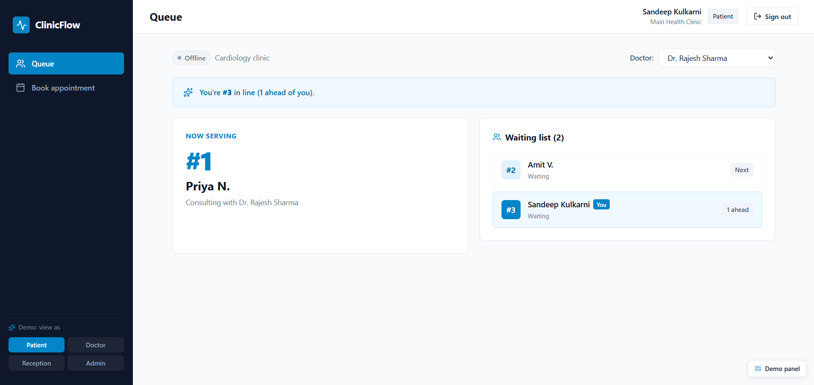
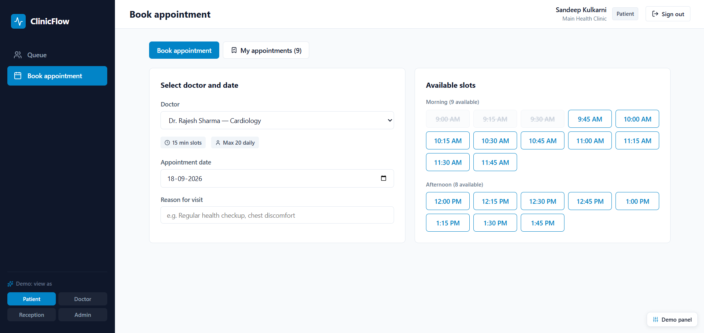
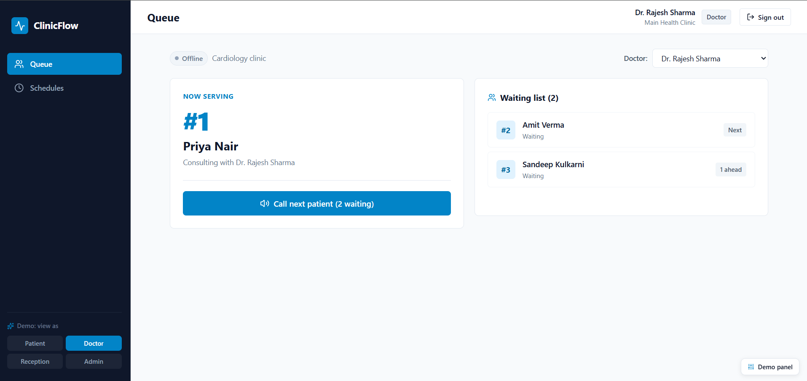
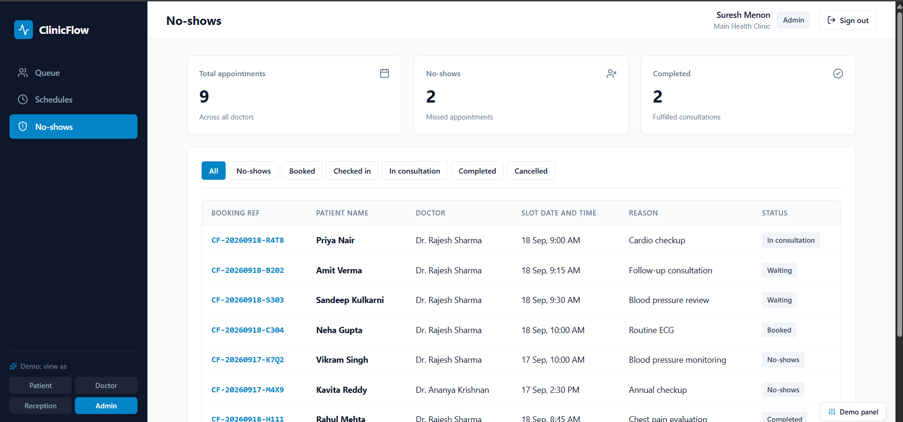

# ClinicFlow

ClinicFlow is a high-performance backend system built for modern clinics to manage real-time patient queues, automated appointment scheduling, and staff roles with robust security and data concurrency handling.


## Features

- **Real-Time Patient Queue**: Powered by WebSocket (STOMP) for immediate UI updates when patients check in or are called by doctors.
- **Robust Concurrency Handling**: Optimistic locking ensures no double-booking of appointment slots, returning clear 409 Conflict responses for rapid retries.
- **Automated Scheduling Engine**: Generates daily slots instantly based on a doctor's consultation length and daily capacity.
- **Distributed Job Scheduling**: Built-in ShedLock mechanism automatically monitors missed appointments and flags "No-Shows" across horizontal clusters.
- **Role-Based Security**: Fine-grained JWT authentication controlling access at the endpoint and method levels (ADMIN, DOCTOR, PATIENT, RECEPTIONIST).
- **Interactive API Docs**: Fully configured Swagger UI (`/swagger-ui.html`) mapping out every endpoint with schema validation.

## Screenshots

### Patient Portal
| Real-Time Queue Tracker | Interactive Slot Booking |
|:---:|:---:|
|  |  |

### Clinic Operations & Administration
| Doctor Consultation Desk | Missed Appointments (ShedLock) & Audit Logs |
|:---:|:---:|
|  |  |

## Architecture

ClinicFlow is containerized for seamless deployment. The architecture utilizes:
- **Java 17 & Spring Boot 3.2**: For rapid REST API and WebSocket development.
- **PostgreSQL**: Serving as the primary relational database with Hibernate ORM.
- **Redis**: For fast scheduling lock coordination (ShedLock) and rapid caching of schedules.
- **Docker & Docker Compose**: Ensuring consistent environments across development and production.

## Getting Started

1. Clone the repository.
2. Make sure Docker and Docker Compose are installed.
3. Run the following command in the project root:
   ```bash
   docker-compose up -d --build
   ```
4. Access the API documentation at `http://localhost:8081/swagger-ui.html`.

*Built to handle the fast-paced flow of modern clinical care.*
